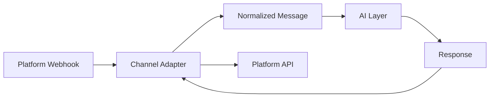

The Pope Bot uses a channel adapter pattern to normalize messages across different chat platforms. This guide shows you how to add support for new channels like Discord, Slack, or WhatsApp.

## Architecture Overview

The channel adapter system separates platform-specific messaging logic from the AI layer:



The AI layer receives the same message format regardless of the source channel. It never knows whether a message came from Telegram, web chat, or any other platform.

## Base Channel Interface

All channel adapters extend the `ChannelAdapter` base class defined in `lib/channels/base.js`:

```javascript
class ChannelAdapter {
  /**
   * Handle an incoming webhook request from this channel.
   * Returns normalized message data or null if no action needed.
   */
  async receive(request) {
    throw new Error('Not implemented');
  }

  /**
   * Called when message is received — adapter shows acknowledgment.
   * Telegram: thumbs up reaction. Slack: emoji reaction. Web: no-op.
   */
  async acknowledge(metadata) {}

  /**
   * Called while AI is processing — adapter shows activity.
   * Telegram: typing indicator. Slack: typing indicator. Web: no-op.
   * Returns a stop function.
   */
  startProcessingIndicator(metadata) {
    return () => {};
  }

  /**
   * Send a complete (non-streaming) response back to the channel.
   */
  async sendResponse(threadId, text, metadata) {
    throw new Error('Not implemented');
  }

  /**
   * Whether this channel supports real streaming (e.g., web chat via Vercel AI SDK).
   * If true, the AI layer provides a stream instead of a complete response.
   */
  get supportsStreaming() {
    return false;
  }
}
```

### Required Methods

- **`receive(request)`** — Parse incoming webhook, validate auth, return normalized message (or `null` to ignore)
- **`sendResponse(threadId, text, metadata)`** — Send the AI's response back to the channel

### Optional Methods

- **`acknowledge(metadata)`** — Show message receipt (e.g., reaction or read receipt)
- **`startProcessingIndicator(metadata)`** — Show activity while AI processes (e.g., typing indicator)
- **`supportsStreaming`** — Return `true` if the channel supports real-time token streaming

## Normalized Message Format

The `receive()` method must return this structure:

```javascript
{
  threadId: string,      // Channel-specific thread/chat identifier
  text: string,          // Message text (voice messages are pre-transcribed)
  attachments: [         // Non-text content for the AI
    { 
      category: "image",     // "image" or "document"
      mimeType: "image/jpeg",
      data: Buffer           // Raw file data
    }
  ],
  metadata: object       // Channel-specific data (message IDs, etc.)
}
```

**Important rules:**

- `text` can be empty string if only attachments are present
- Voice/audio messages must be transcribed to text by the adapter — not passed as attachments
- Attachments are always `Buffer` objects, never URLs or file paths
- `metadata` is opaque to the AI layer — used only for sending responses

## Implementation Guide

Follow these steps to add a new channel:

<Steps>
  <Step title="Create the adapter class">
    Create a new file in `lib/channels/` (e.g., `discord.js`):
    
    ```javascript
    import { ChannelAdapter } from './base.js';

    class DiscordAdapter extends ChannelAdapter {
      constructor(botToken) {
        super();
        this.botToken = botToken;
      }

      async receive(request) {
        // TODO: Parse webhook, validate signature
        // TODO: Download attachments
        // TODO: Return normalized message or null
      }

      async sendResponse(threadId, text, metadata) {
        // TODO: Call Discord API to send message
      }

      // Optional: Add acknowledgment and typing indicator
    }

    export { DiscordAdapter };
    ```
  </Step>
  
  <Step title="Implement receive() method">
    Parse the incoming webhook and validate authentication:
    
    ```javascript
    async receive(request) {
      const { DISCORD_PUBLIC_KEY, DISCORD_ALLOWED_CHANNEL } = process.env;

      // Validate webhook signature
      const signature = request.headers.get('x-signature-ed25519');
      const timestamp = request.headers.get('x-signature-timestamp');
      const body = await request.text();
      
      if (!verifyDiscordSignature(body, signature, timestamp, DISCORD_PUBLIC_KEY)) {
        console.error('[discord] Invalid signature');
        return null;
      }

      const data = JSON.parse(body);
      
      // Handle Discord ping
      if (data.type === 1) {
        return null; // Special handling needed in route
      }

      // Ignore messages from other channels
      if (data.channel_id !== DISCORD_ALLOWED_CHANNEL) {
        return null;
      }

      const message = data.data;
      let text = message.content || '';
      const attachments = [];

      // Download attachments
      for (const attachment of message.attachments || []) {
        const response = await fetch(attachment.url);
        const buffer = Buffer.from(await response.arrayBuffer());
        
        if (attachment.content_type.startsWith('image/')) {
          attachments.push({
            category: 'image',
            mimeType: attachment.content_type,
            data: buffer,
          });
        }
      }

      return {
        threadId: data.channel_id,
        text,
        attachments,
        metadata: {
          messageId: data.id,
          channelId: data.channel_id,
          token: data.token,
        },
      };
    }
    ```
    
    **Key considerations:**
    
    - Always validate authentication (signature, token, secret)
    - Return `null` for messages you want to ignore
    - Download files and convert to `Buffer` objects
    - Store necessary response data in `metadata`
  </Step>
  
  <Step title="Implement sendResponse() method">
    Send the AI's response back through the platform API:
    
    ```javascript
    async sendResponse(threadId, text, metadata) {
      const url = `https://discord.com/api/v10/channels/${threadId}/messages`;
      
      const response = await fetch(url, {
        method: 'POST',
        headers: {
          'Authorization': `Bot ${this.botToken}`,
          'Content-Type': 'application/json',
        },
        body: JSON.stringify({ content: text }),
      });

      if (!response.ok) {
        console.error('[discord] Failed to send message:', await response.text());
      }
    }
    ```
  </Step>
  
  <Step title="Add optional user feedback">
    Implement acknowledgment and typing indicator for better UX:
    
    ```javascript
    async acknowledge(metadata) {
      // Add a reaction to show message received
      const url = `https://discord.com/api/v10/channels/${metadata.channelId}/messages/${metadata.messageId}/reactions/👍/@me`;
      
      await fetch(url, {
        method: 'PUT',
        headers: { 'Authorization': `Bot ${this.botToken}` },
      });
    }

    startProcessingIndicator(metadata) {
      const url = `https://discord.com/api/v10/channels/${metadata.channelId}/typing`;
      
      // Send typing indicator every 8 seconds
      const interval = setInterval(() => {
        fetch(url, {
          method: 'POST',
          headers: { 'Authorization': `Bot ${this.botToken}` },
        });
      }, 8000);

      // Return stop function
      return () => clearInterval(interval);
    }
    ```
  </Step>
  
  <Step title="Create a factory function">
    Add a factory function in `lib/channels/index.js` using the lazy singleton pattern:
    
    ```javascript
    import { DiscordAdapter } from './discord.js';

    let _discordAdapter = null;

    export function getDiscordAdapter(botToken) {
      if (!_discordAdapter || _discordAdapter.botToken !== botToken) {
        _discordAdapter = new DiscordAdapter(botToken);
      }
      return _discordAdapter;
    }
    ```
  </Step>
  
  <Step title="Add a webhook route">
    Create a route handler in `api/index.js` to receive webhooks:
    
    ```javascript
    async function handleDiscordWebhook(request) {
      const botToken = process.env.DISCORD_BOT_TOKEN;
      if (!botToken) {
        return Response.json(
          { error: 'DISCORD_BOT_TOKEN not configured' },
          { status: 500 }
        );
      }

      const adapter = getDiscordAdapter(botToken);
      const messageData = await adapter.receive(request);

      if (!messageData) {
        return new Response('OK', { status: 200 });
      }

      // Process message with AI
      const { threadId, text, attachments, metadata } = messageData;
      await adapter.acknowledge(metadata);
      const stopIndicator = adapter.startProcessingIndicator(metadata);

      const userId = 'discord';
      const response = await chat(threadId, text, attachments, { userId });
      
      stopIndicator();
      await adapter.sendResponse(threadId, response, metadata);

      return new Response('OK', { status: 200 });
    }

    // Register in route handler
    export async function POST(request) {
      const pathname = new URL(request.url).pathname;
      
      if (pathname === '/api/discord/webhook') {
        return handleDiscordWebhook(request);
      }
      
      // ... other routes
    }
    ```
    
    Add `/discord/webhook` to `PUBLIC_ROUTES` array since it uses its own auth.
  </Step>
  
  <Step title="Add environment variables">
    Document required environment variables:
    
    ```bash
    # Discord bot token
    DISCORD_BOT_TOKEN=your-bot-token
    
    # Discord public key (for signature verification)
    DISCORD_PUBLIC_KEY=your-public-key
    
    # Allowed channel ID (security)
    DISCORD_ALLOWED_CHANNEL=1234567890
    ```
  </Step>
</Steps>

## Reference Implementation

The `TelegramAdapter` in `lib/channels/telegram.js` is the reference implementation. It demonstrates:

- Webhook secret validation
- Chat ID authorization
- Downloading files from authenticated endpoints
- Voice transcription (Whisper integration)
- Message acknowledgment (reaction)
- Typing indicators

Here's the full structure:

```javascript
import { ChannelAdapter } from './base.js';
import {
  sendMessage,
  downloadFile,
  reactToMessage,
  startTypingIndicator,
} from '../tools/telegram.js';
import { isWhisperEnabled, transcribeAudio } from '../tools/openai.js';

class TelegramAdapter extends ChannelAdapter {
  constructor(botToken) {
    super();
    this.botToken = botToken;
  }

  async receive(request) {
    const { TELEGRAM_WEBHOOK_SECRET, TELEGRAM_CHAT_ID } = process.env;

    // Validate secret token
    const headerSecret = request.headers.get('x-telegram-bot-api-secret-token');
    if (headerSecret !== TELEGRAM_WEBHOOK_SECRET) {
      return null;
    }

    const update = await request.json();
    const message = update.message || update.edited_message;
    const chatId = String(message.chat.id);
    
    // Security: only accept messages from configured chat
    if (chatId !== TELEGRAM_CHAT_ID) return null;

    let text = message.text || null;
    const attachments = [];

    // Voice → transcribe
    if (message.voice) {
      const { buffer, filename } = await downloadFile(this.botToken, message.voice.file_id);
      text = await transcribeAudio(buffer, filename);
    }

    // Photo → download
    if (message.photo) {
      const largest = message.photo[message.photo.length - 1];
      const { buffer } = await downloadFile(this.botToken, largest.file_id);
      attachments.push({ category: 'image', mimeType: 'image/jpeg', data: buffer });
    }

    return {
      threadId: chatId,
      text: text || '',
      attachments,
      metadata: { messageId: message.message_id, chatId },
    };
  }

  async acknowledge(metadata) {
    await reactToMessage(this.botToken, metadata.chatId, metadata.messageId);
  }

  startProcessingIndicator(metadata) {
    return startTypingIndicator(this.botToken, metadata.chatId);
  }

  async sendResponse(threadId, text, metadata) {
    await sendMessage(this.botToken, threadId, text);
  }

  get supportsStreaming() {
    return false;
  }
}
```

**From lib/channels/telegram.js:10-148**

## Streaming Support

If your channel supports real-time token streaming (like web chat via Server-Sent Events), set `supportsStreaming` to `true`:

```javascript
get supportsStreaming() {
  return true;
}
```

When streaming is enabled, the AI layer will provide an async generator instead of a complete response:

```javascript
for await (const chunk of aiStream(threadId, text, attachments)) {
  if (chunk.type === 'text') {
    await adapter.sendStreamChunk(threadId, chunk.text, metadata);
  }
}
```

You'll need to implement `sendStreamChunk()` to send incremental updates.

<Warning>
Most messaging platforms (Telegram, Discord, Slack) do **not** support real-time streaming. Only use streaming for web-based interfaces with SSE or WebSocket support.
</Warning>

## Testing Your Adapter

Test your adapter implementation:

<Steps>
  <Step title="Unit test the receive() method">
    ```javascript
    import { DiscordAdapter } from './discord.js';

    const adapter = new DiscordAdapter('test-token');

    // Mock request
    const request = new Request('https://example.com/webhook', {
      method: 'POST',
      headers: {
        'x-signature-ed25519': 'valid-signature',
        'x-signature-timestamp': '1234567890',
      },
      body: JSON.stringify({
        type: 2, // Message
        channel_id: 'test-channel',
        data: {
          content: 'Hello bot',
          attachments: [],
        },
      }),
    });

    const result = await adapter.receive(request);
    console.log(result);
    ```
  </Step>
  
  <Step title="Test webhook endpoint">
    ```bash
    curl -X POST http://localhost:3000/api/discord/webhook \
      -H "Content-Type: application/json" \
      -H "x-signature-ed25519: valid-signature" \
      -H "x-signature-timestamp: 1234567890" \
      -d '{
        "type": 2,
        "channel_id": "test-channel",
        "data": {
          "content": "Test message"
        }
      }'
    ```
  </Step>
  
  <Step title="Test end-to-end flow">
    1. Register your webhook with the platform
    2. Send a message from the platform
    3. Check event handler logs for errors
    4. Verify the bot responds correctly
  </Step>
</Steps>

## Channel-Agnostic AI Layer

**The AI layer requires zero changes** when adding new channels. It receives normalized messages and returns responses regardless of the source.

From the AI's perspective:

```javascript
// lib/ai/index.js (simplified)
export async function chat(threadId, text, attachments, options = {}) {
  const userId = options.userId || 'web';
  
  // Save user message
  saveMessage(threadId, userId, 'user', text, attachments);
  
  // Generate response
  const response = await generateResponse(threadId, text, attachments);
  
  // Save assistant message
  saveMessage(threadId, userId, 'assistant', response);
  
  return response;
}
```

The `userId` parameter (`'telegram'`, `'discord'`, etc.) is only used for database storage — it doesn't affect AI behavior.

## Potential Integrations

The adapter pattern makes it straightforward to add any channel that supports webhooks:

<CardGroup cols={2}>
  <Card title="Discord" icon="discord">
    Bot webhooks with slash commands and interactions
  </Card>
  <Card title="Slack" icon="slack">
    Events API with slash commands and app mentions
  </Card>
  <Card title="WhatsApp" icon="whatsapp">
    Business API webhooks for messages and media
  </Card>
  <Card title="SMS" icon="message">
    Twilio webhooks for text messages
  </Card>
  <Card title="Email" icon="envelope">
    Inbound email parsing (SendGrid, Mailgun)
  </Card>
  <Card title="Microsoft Teams" icon="microsoft">
    Bot Framework webhooks and adaptive cards
  </Card>
</CardGroup>

All follow the same pattern:

1. Receive webhook
2. Validate authentication
3. Normalize to `{ threadId, text, attachments, metadata }`
4. Send response back

## Related Resources

<CardGroup cols={2}>
  <Card title="Web Interface" icon="browser" href="/chat/web-interface">
    Learn about the built-in web chat
  </Card>
  <Card title="Telegram Integration" icon="telegram" href="/chat/telegram">
    Reference implementation
  </Card>
</CardGroup>
