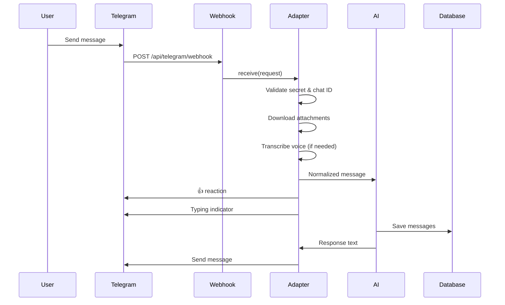

Connect a Telegram bot to chat with your agent on mobile. The Pope Bot supports text, voice messages, photos, and documents via Telegram.

## Setup Process

Use the interactive setup wizard to configure your Telegram bot:

<Steps>
  <Step title="Run the setup wizard">
    ```bash
    npm run setup-telegram
    ```
    
    The wizard will guide you through:
    - Creating a bot via @BotFather
    - Configuring the webhook URL
    - Setting up chat authorization
  </Step>
  
  <Step title="Create a bot with BotFather">
    If you don't have a bot token yet:
    
    1. Open Telegram and search for `@BotFather`
    2. Send `/newbot` and follow the prompts
    3. Copy the bot token provided
    4. Enter it in the setup wizard
  </Step>
  
  <Step title="Configure webhook URL">
    The wizard will automatically configure your webhook at:
    
    ```
    https://your-domain.com/api/telegram/webhook
    ```
    
    The webhook is secured with a secret token that's automatically generated.
  </Step>
  
  <Step title="Authorize your chat">
    1. Start a conversation with your bot in Telegram
    2. Send the verification code shown by the wizard
    3. The bot will reply with your chat ID
    4. The wizard saves this to your configuration
  </Step>
  
  <Step title="Test the integration">
    Send a message to your bot. You should receive a 👍 reaction, followed by a streaming response.
  </Step>
</Steps>

## Manual Configuration

If you prefer manual setup, add these environment variables:

```bash
# Bot token from @BotFather
TELEGRAM_BOT_TOKEN=1234567890:ABCdefGHIjklMNOpqrsTUVwxyz

# Webhook secret (generate with: openssl rand -hex 32)
TELEGRAM_WEBHOOK_SECRET=your-random-secret-here

# Your chat ID (get from @userinfobot)
TELEGRAM_CHAT_ID=123456789

# Optional: verification code for initial setup
TELEGRAM_VERIFICATION=verify123
```

Then register the webhook manually:

```bash
curl -X POST https://api.telegram.org/bot<TOKEN>/setWebhook \
  -H "Content-Type: application/json" \
  -d '{
    "url": "https://your-domain.com/api/telegram/webhook",
    "secret_token": "your-random-secret-here"
  }'
```

## Message Flow

Here's how messages flow through the system:



### Webhook Validation

The Telegram adapter validates every incoming webhook request:

```javascript
// From lib/channels/telegram.js
async receive(request) {
  const { TELEGRAM_WEBHOOK_SECRET, TELEGRAM_CHAT_ID } = process.env;

  // Validate secret token (required)
  if (!TELEGRAM_WEBHOOK_SECRET) {
    console.error('[telegram] TELEGRAM_WEBHOOK_SECRET not configured');
    return null;
  }
  
  const headerSecret = request.headers.get('x-telegram-bot-api-secret-token');
  if (headerSecret !== TELEGRAM_WEBHOOK_SECRET) {
    return null;
  }

  const update = await request.json();
  const message = update.message || update.edited_message;
  const chatId = String(message.chat.id);

  // Security: only accept messages from configured chat
  if (chatId !== TELEGRAM_CHAT_ID) return null;
  
  // ... process message
}
```

**Security notes:**

- `TELEGRAM_WEBHOOK_SECRET` must be set or all webhooks are rejected
- `TELEGRAM_CHAT_ID` must match or messages are ignored
- Secret comparison uses the header `x-telegram-bot-api-secret-token`

### Message Normalization

The adapter converts Telegram's message format into a channel-agnostic structure:

```javascript
{
  threadId: string,      // Telegram chat ID
  text: string,          // Message text or transcription
  attachments: [         // Downloaded files
    { category: "image", mimeType: "image/jpeg", data: Buffer },
    { category: "document", mimeType: "application/pdf", data: Buffer }
  ],
  metadata: {            // Telegram-specific data
    messageId: number,
    chatId: string
  }
}
```

## Supported Message Types

### Text Messages

Plain text messages are passed directly to the AI:

```javascript
const text = message.text || null;
return { threadId: chatId, text, attachments: [], metadata };
```

### Voice Messages

Voice messages are automatically transcribed via OpenAI Whisper:

```javascript
// From lib/channels/telegram.js
if (message.voice) {
  if (!isWhisperEnabled()) {
    await sendMessage(
      this.botToken,
      chatId,
      'Voice messages require OPENAI_API_KEY for transcription.'
    );
    return null;
  }
  
  const { buffer, filename } = await downloadFile(this.botToken, message.voice.file_id);
  text = await transcribeAudio(buffer, filename);
}
```

**Requirements:**
- Requires `OPENAI_API_KEY` environment variable
- Uses the `whisper-1` model
- Transcription happens before the message reaches the AI layer

### Audio Messages

Audio files are handled identically to voice messages — transcribed to text:

```javascript
if (message.audio && !text) {
  const { buffer, filename } = await downloadFile(this.botToken, message.audio.file_id);
  text = await transcribeAudio(buffer, filename);
}
```

### Photos

Photos are downloaded and passed as image attachments:

```javascript
if (message.photo && message.photo.length > 0) {
  const largest = message.photo[message.photo.length - 1];
  const { buffer } = await downloadFile(this.botToken, largest.file_id);
  attachments.push({ category: 'image', mimeType: 'image/jpeg', data: buffer });
  
  // Use caption as text if provided
  if (!text && message.caption) text = message.caption;
}
```

The adapter downloads the **largest available size** of each photo.

### Documents

Documents (PDFs, text files, etc.) are downloaded and attached:

```javascript
if (message.document) {
  const { buffer, filename } = await downloadFile(this.botToken, message.document.file_id);
  const mimeType = message.document.mime_type || 'application/octet-stream';
  attachments.push({ category: 'document', mimeType, data: buffer });
  
  if (!text && message.caption) text = message.caption;
}
```

## User Feedback

The adapter provides immediate feedback while processing:

### Acknowledgment

A thumbs-up reaction is added when the message is received:

```javascript
async acknowledge(metadata) {
  await reactToMessage(this.botToken, metadata.chatId, metadata.messageId);
}
```

### Typing Indicator

A typing indicator shows while the AI is processing:

```javascript
startProcessingIndicator(metadata) {
  return startTypingIndicator(this.botToken, metadata.chatId);
}
```

The typing indicator automatically refreshes every 5 seconds until the response is ready.

### Sending Responses

Complete responses are sent back as regular Telegram messages:

```javascript
async sendResponse(threadId, text, metadata) {
  await sendMessage(this.botToken, threadId, text);
}
```

<Note>
Telegram does **not** support real-time streaming. The `supportsStreaming` getter returns `false`, so the AI generates the complete response before sending.
</Note>

## Chat History

Telegram conversations are stored in the same database as web chats with a special user ID:

```javascript
// From lib/chat/actions.js
export async function getChats(limit) {
  return db
    .select()
    .from(chats)
    .where(or(
      eq(chats.userId, user.id),      // Web chat
      eq(chats.userId, 'telegram')     // Telegram chat
    ))
    .orderBy(desc(chats.updatedAt))
    .all();
}
```

Telegram chats appear in the web interface sidebar with a `userId` of `'telegram'`. This allows users to:

- View Telegram conversation history in the web UI
- Resume Telegram chats from the browser
- Star or delete Telegram conversations

## API Endpoint

The webhook endpoint is defined in `api/index.js`:

```javascript
// POST /api/telegram/webhook
async function handleTelegramWebhook(request) {
  const botToken = getTelegramBotToken();
  if (!botToken) {
    return Response.json({ error: 'TELEGRAM_BOT_TOKEN not configured' }, { status: 500 });
  }

  const adapter = getTelegramAdapter(botToken);
  const messageData = await adapter.receive(request);

  if (!messageData) {
    return new Response('OK', { status: 200 });
  }

  // Fire triggers before processing
  const fireTriggers = getFireTriggers();
  await fireTriggers('/telegram/webhook', request);

  // Process message with AI
  const { threadId, text, attachments, metadata } = messageData;
  await adapter.acknowledge(metadata);
  const stopIndicator = adapter.startProcessingIndicator(metadata);

  const userId = 'telegram';
  const response = await chat(threadId, text, attachments, { userId });
  
  stopIndicator();
  await adapter.sendResponse(threadId, response, metadata);

  return new Response('OK', { status: 200 });
}
```

The endpoint is **public** — it doesn't require an API key, but validates the webhook secret instead.

## Troubleshooting

### Bot doesn't respond

<AccordionGroup>
  <Accordion title="Check webhook configuration">
    Verify the webhook is registered:
    
    ```bash
    curl https://api.telegram.org/bot<TOKEN>/getWebhookInfo
    ```
    
    Should return your webhook URL and pending update count.
  </Accordion>
  
  <Accordion title="Verify environment variables">
    Check that all required variables are set:
    
    - `TELEGRAM_BOT_TOKEN`
    - `TELEGRAM_WEBHOOK_SECRET`
    - `TELEGRAM_CHAT_ID`
  </Accordion>
  
  <Accordion title="Check server logs">
    Look for errors in the event handler logs:
    
    ```bash
    docker logs thepopebot-event-handler
    ```
    
    Common issues:
    - Secret mismatch
    - Chat ID mismatch
    - Missing OPENAI_API_KEY for voice
  </Accordion>
</AccordionGroup>

### Voice messages not transcribed

<AccordionGroup>
  <Accordion title="Verify OpenAI API key">
    Voice transcription requires `OPENAI_API_KEY`:
    
    ```bash
    echo $OPENAI_API_KEY
    ```
  </Accordion>
  
  <Accordion title="Check Whisper availability">
    The adapter checks if Whisper is enabled:
    
    ```javascript
    if (!isWhisperEnabled()) {
      // Will send error message to user
    }
    ```
  </Accordion>
</AccordionGroup>

### Webhook not receiving updates

<AccordionGroup>
  <Accordion title="Check public accessibility">
    Your webhook URL must be publicly accessible over HTTPS. Test with:
    
    ```bash
    curl -X POST https://your-domain.com/api/telegram/webhook \
      -H "x-telegram-bot-api-secret-token: your-secret" \
      -H "Content-Type: application/json" \
      -d '{"message":{"chat":{"id":123}}}'
    ```
  </Accordion>
  
  <Accordion title="Verify SSL certificate">
    Telegram requires valid HTTPS. Self-signed certificates won't work.
  </Accordion>
  
  <Accordion title="Check Telegram API status">
    Sometimes Telegram's API has issues. Check https://downdetector.com/status/telegram/
  </Accordion>
</AccordionGroup>

## Related Resources

<CardGroup cols={2}>
  <Card title="Web Interface" icon="browser" href="/chat/web-interface">
    Learn about the built-in web chat
  </Card>
  <Card title="Adding Channels" icon="plug" href="/chat/adding-channels">
    Build custom channel adapters
  </Card>
</CardGroup>
